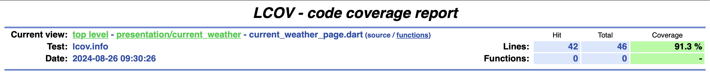
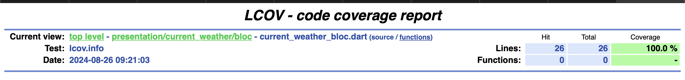

# Razor ERP Exam

Razor ERP Exam is a Flutter application designed to provide weather forecasts using the OpenWeatherMap API.

### Test Coverage

#### Widget Tests

#### Bloc Tests

## Getting Started

This application retrieves weather data from the OpenWeatherMap API by making a request to the following endpoint:

Replace `{{lat}}`, `{{long}}`, and `{{apiKey}}` with the appropriate latitude, longitude, and your API key.

### Prerequisites

- Flutter SDK
- An OpenWeatherMap API key

### Features

- Weather forecast display based on the user's location.

### Checklist

- [x] Integrated `dio` to call REST API with API key as an interceptor.
- [x] Implemented `bloc` for state management.
- [x] Used `built_value` for JSON deserialization.
- [x] Added `hydrated_bloc` to store the last record, allowing users to view it even when offline.
- [x] Utilized `geolocator` to get the user's current location.
- [x] Wrote widget tests and unit tests.

### Additional Resources

For more information on Flutter development, check out the following resources:

- [Flutter Codelabs](https://docs.flutter.dev/get-started/codelab)
- [Flutter Cookbook](https://docs.flutter.dev/cookbook)

For full documentation, tutorials, and API references, visit the [Flutter website](https://docs.flutter.dev/).
