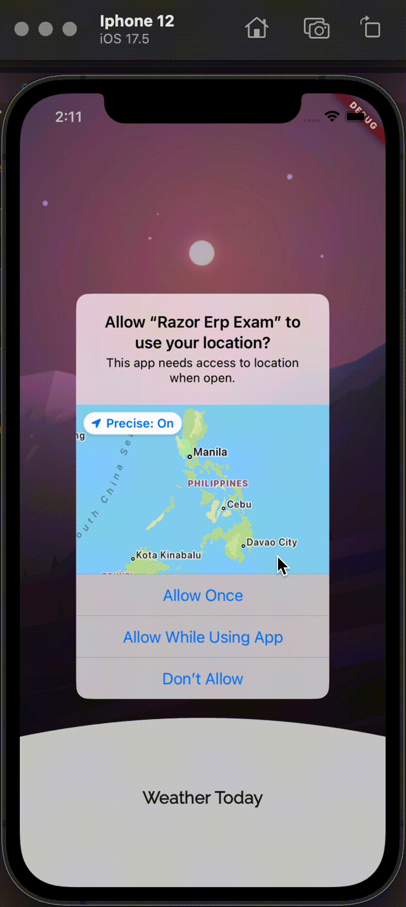

# Razor ERP Exam

Razor ERP Exam is a Flutter application designed to provide weather forecasts using the OpenWeatherMap API.

## Getting Started

This application retrieves weather data from the OpenWeatherMap API by making a request to the following endpoint:

Replace `{{lat}}`, `{{long}}`, and `{{apiKey}}` with the appropriate latitude, longitude, and your API key.

### Prerequisites

- Flutter SDK
- An OpenWeatherMap API key

### Features

- 
### Additional Resources

For more information on Flutter development, check out the following resources:

- [Flutter Codelabs](https://docs.flutter.dev/get-started/codelab)
- [Flutter Cookbook](https://docs.flutter.dev/cookbook)

For full documentation, tutorials, and API references, visit the [Flutter website](https://docs.flutter.dev/).
